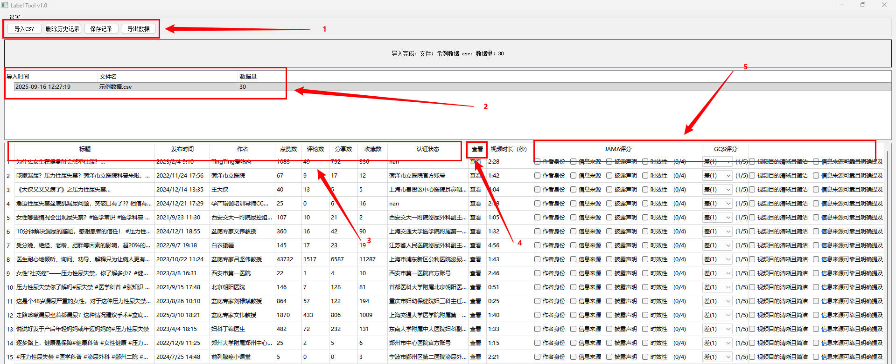
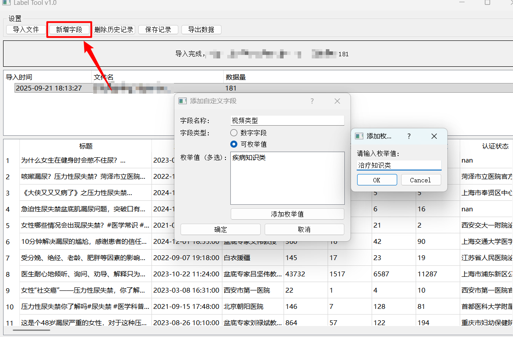

# **Label_Tool**: 短视频SCI科学传播内容评分标注工具

一款轻量型工具，专注于**短视频SCI（科学传播类短视频）** 的质量评分与属性标注，为**学术研究、内容评估**等场景提供数据处理支持。

## 🖼️ 工具界面预览

<figure style="text-align: center; margin: 20px 0; position: relative;">
  
  

  

</figure>

<figure style="text-align: center; margin: 20px 0; position: relative;">
  
  

  

</figure>

## 🔧 核心功能

| 模块 | 功能说明 | 对应界面区域 |
|---------|----------|--------------|
| **数据管理** | 导入**UTF-8编码CSV**文件，定向删除历史数据，**实时保存**标注进度，导出**UTF-8格式**结果 | 设置区 |
| **历史回溯** | 展示所有导入数据情况 | 历史管理区 |
| **信息概览** | 结构化呈现数据基础属性，快速定位数据背景 | 基础信息区 |
| **视频预览** | 一键播放当前标注任务对应的短视频，**便捷获取内容信息** | 视频查看区 |
| **标注功能** | 包含评分指标（**JAMA score、QGS、m_discern**）与属性标注（**作者类型、视频类型**） | 标注区 |
| **自定义打分字段** | 允许用户根据自己需求自定义打分的字段（更新日期2025年9月21日） | 标注区 |

## 📏 标注规则

### 1. **JAMA score**（二元计分：**1=符合，0=不符合**）

- **作者身份**：需明确作者、所属机构及专业资质，信息不全计0分
- **归属来源**：引用内容需标注文献、数据来源及版权，无来源计0分
- **利益披露**：需说明赞助、资助等潜在利益冲突，未披露计0分
- **时效性**：需标注发布/更新日期，信息过时或无时间标注计0分

### 2. **m_discern**（二元计分：**1=符合，0=不符合**）

- 内容是否**清晰简洁、易于理解**？
- 是否引用**同行评议文献**等有效来源？
- 表达是否**客观均衡、无立场偏倚**？
- 是否提供受众**可延伸参考的信息渠道**？
- 是否提及**存在不确定性的领域**？

### 3. **GQS**（1-5分量表评分）

- **1分**：质量差、逻辑乱、信息缺失，**无实用价值**
- **2分**：质量与连贯性差，关键信息遗漏多，**实用价值极低**
- **3分**：质量中等，部分信息充分，**有一定参考价值**
- **4分**：质量良好、连贯性强，覆盖多数信息，**有明确帮助**
- **5分**：质量极佳、逻辑清晰，信息全面，**实用价值高**

## 🚀 快速上手

1.  准备**UTF-8编码的CSV数据文件**（参考示例格式）
2.  通过界面**「设置区」** 点击导入按钮上传数据
3.  在**「历史管理区」** 选择需要处理的目标数据批次
4.  点击**「视频查看」** 播放内容，在**「标注区」** 完成评分与属性标注
5.  标注完成后，通过**「设置区」** 的导出功能获取**CSV格式结果**

## 🔧 更新

- 更新了自定义字段的功能，允许用户根据自己需求定义打分的字段；支持传入csv、excel、txt格式数据。-2025年9月21日

## 📌 注意事项

- 标注规则供参考，可根据**具体研究需求**灵活调整适配

## 💬 反馈与联系

如有**功能建议、Bug反馈**或使用问题，欢迎通过以下渠道联系：
- 小红书主页：[https://xhslink.com/m/XOmRVVwyqv](https://xhslink.com/m/XOmRVVwyqv)
- 邮箱：**Dr_Ash2077@163.com**